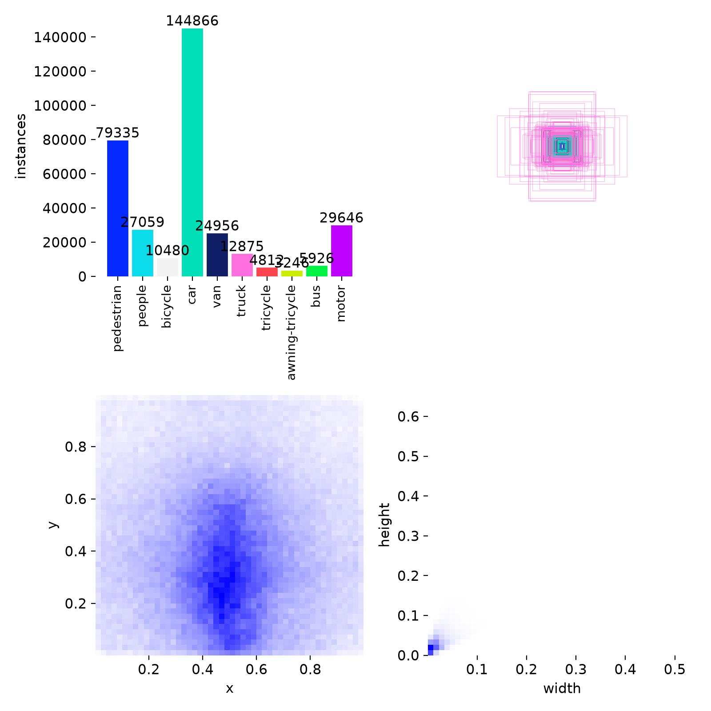
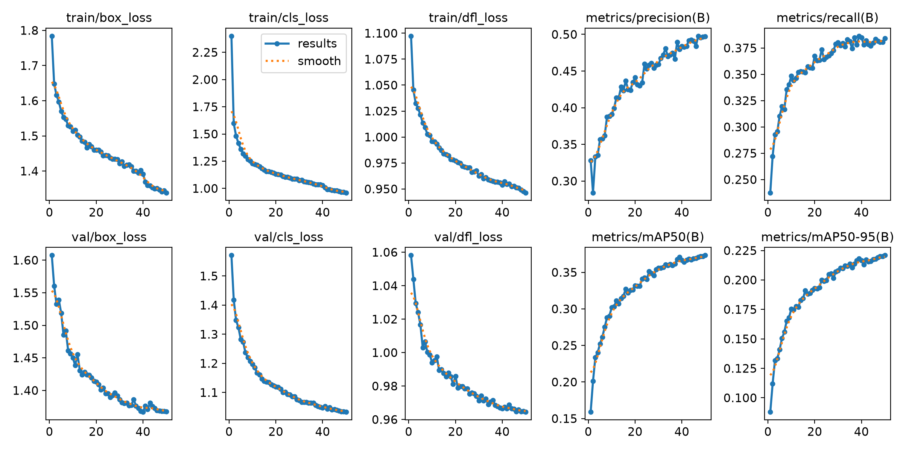
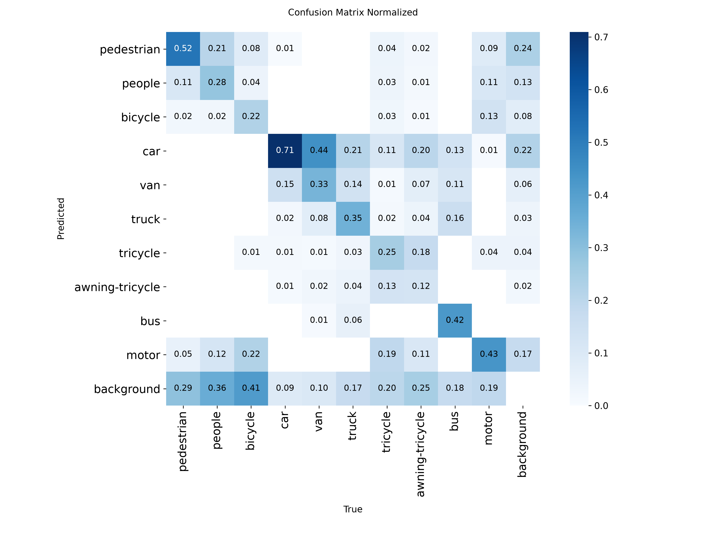

# Small-Object Detection on Drone Imagery

Object detection, tracking and deployment benchmarking with YOLO11 on
VisDrone2019 — trained, evaluated, exported to ONNX, and run through a
tracking pipeline with a measured deployment profile.

Aerial frames are large and the things worth detecting in them are tiny. The
label statistics are measured before training to justify the input resolution
chosen, rather than assumed.

---

## Why this dataset

[VisDrone2019](https://github.com/VisDrone/VisDrone-Dataset) is drone-captured
imagery across 10 classes (pedestrian, car, van, truck, bus, motor, …).

- **6,471** training / **548** validation frames. Resolutions are mixed, not
  uniform: the val split is entirely 16:9 (1360×765, 960×540 or 1920×1080);
  train mixes those with 4:3 frames as large as 2000×1500.
- **38,759** annotated boxes in the validation split alone — a mean of **~71
  objects per frame**, against roughly 7 for COCO.

That object density is not incidental — it drives most of the engineering
decisions below.



Training split (6,471 frames), not val. The width/height scatter bottom-right
is the same "boxes are tiny" fact as the analysis below, from a different
angle: normalised box width and height both cluster near 0, with essentially
nothing past ~0.1 on either axis.

The bar labels are Ultralytics' own count and differ slightly from a direct
read of the label files: `car` 144,866 vs 144,867, `pedestrian` 79,335 vs
79,337, `motor` 29,646 vs 29,647. The other seven classes match exactly, so
the bars sum to 343,201 against a direct total of 343,205. The gap is four
boxes confined to the three largest classes, not a per-class offset. Counts
quoted elsewhere in this README are the direct ones (`class_balance` in
`reports/evaluation_train.json`), so adding up the bars will not quite
reproduce them.

---

## The problem, quantified

Before choosing an input resolution, measure what the labels actually look
like. Box areas are normalised in YOLO format, so `w*h` is directly the
fraction of frame covered — no need to open the images.

| ground-truth box scale (val, 38,759 boxes) | share |
| --- | --- |
| small — under 32×32 px | **92.4 %** |
| medium — 32×32 to 96×96 px | 7.5 % |
| large — over 96×96 px | 0.1 % |

COCO's small/medium/large thresholds, applied to the pixel area each box
actually occupies at a 640 px input *after letterboxing*. Applying them as a
fixed share of the frame instead (the usual `<0.25 %` shortcut) assumes the
image is squashed to 640×640, which is the very thing the paragraph below
says YOLO does not do.

From `reports/evaluation.json`. The train split is in
`reports/evaluation_train.json` and is slightly less extreme — 90.5 % small
across 343,205 boxes — because it mixes 4:3 frames with the val split's
uniform 16:9.

The median box covers 0.055 % of the frame. Converting that to a pixel size
needs the source image's actual dimensions, not just the target resolution —
YOLO letterboxes (scales both axes by the same factor, padding the short
side) rather than stretching to a square, so a naive `sqrt(area) * imgsz`
overstates the box's true rendered size whenever the source isn't already
square. Computed per-image from the val split's real dimensions (100% 16:9
here): the median box is a **11 px** object at the YOLO default of 640 px
input, or **18 px** at 1024 px. Better than nine in ten objects in this
dataset are in the regime where downscaling destroys them, which is why this
trains at 1024px rather than the default.

---

## Results

YOLO11n, 1024px, 50 epochs, 197.6 min on an RTX 2070 Max-Q.

**mAP50 0.373, mAP50-95 0.221.** This is the training run's own final
validation (`runs/n_1024/results.csv`, the pass used to select the checkpoint).
`src/benchmark.py` re-validates independently to pair accuracy with its own
latency numbers below and gets a very slightly different figure — mAP50
0.3748, mAP50-95 0.2216, in `reports/benchmark.json`. The in-training pass
runs under AMP (`amp: true` in `runs/n_1024/args.yaml`, so fp16) and the
standalone one in fp32, so the two are not numerically identical. Same
weights, same split.



Both mAP curves are still rising at epoch 50 — see "What this does not
establish" below.

Per-class breakdown, sorted by difficulty, shows why the aggregate number is
not the interesting one. These rows come from `src/evaluate.py`'s standalone
fp32 pass (`reports/evaluation.json`), so their arithmetic mean is exactly the
0.3748 / 0.2216 above and *not* results.csv's 0.3733 / 0.2209 — worth checking
against the table yourself. `share of labels` is the val split, matching the
metrics beside it.

| class | P | R | mAP50 | mAP50-95 | share of labels |
| --- | --- | --- | --- | --- | --- |
| bicycle | 0.298 | 0.152 | 0.111 | **0.049** | 3.3 % |
| awning-tricycle | 0.267 | 0.177 | 0.125 | 0.081 | 1.4 % |
| people | 0.524 | 0.300 | 0.304 | 0.113 | 13.2 % |
| tricycle | 0.407 | 0.296 | 0.254 | 0.142 | 2.7 % |
| motor | 0.507 | 0.434 | 0.423 | 0.182 | 12.6 % |
| pedestrian | 0.532 | 0.445 | 0.440 | 0.198 | 22.8 % |
| truck | 0.479 | 0.373 | 0.357 | 0.239 | 1.9 % |
| van | 0.516 | 0.428 | 0.423 | 0.290 | 5.1 % |
| bus | 0.725 | 0.466 | 0.515 | 0.374 | 0.6 % |
| car | 0.697 | 0.797 | 0.796 | **0.548** | 36.3 % |

**The spread between best and worst class (11×) is not explained by label
frequency.** Training signal has to be counted on the train split, not the val
shares above: there `pedestrian` has 79,337 boxes to `bus`'s 5,926, so 13×
more — and `bus` is not even the rarest training class, `awning-tricycle`
(3,246) is. Those counts are in `reports/evaluation_train.json`
(`python src/evaluate.py --split train`), so they can be checked without
downloading the dataset. `bus` still scores nearly double `pedestrian` on
mAP50-95 (0.374 vs 0.198). What separates them is apparent size: a bus occupies
tens of pixels from altitude, a pedestrian occupies a handful, and the
label-scale table above is exactly where that prediction came from.

The confusion matrix below isolates this. `pedestrian` is *classified* better
than `bus` (0.52 of true instances correct, against 0.42) and still scores
half the mAP50-95. Since mAP50-95 averages IoU thresholds from 0.5 to 0.95, a
two-pixel boundary error on an 11 px box costs what it would not cost on a bus.
The gap is localisation precision under scale, not recognition.



Columns are the true class and sum to 1, so each column splits three ways:
correct, missed (the `background` row), and misclassified (everything else).
Splitting them apart is the part the aggregate mAP hides, and the two failure
modes are not distributed evenly.

`src/evaluate.py` emits this split per class as `error_split` in
`reports/evaluation.json`, so the numbers below are citable rather than read
off the image:

| true class | correct | missed | misclassified | mostly as |
| --- | --- | --- | --- | --- |
| awning-tricycle | 0.14 | 0.25 | **0.61** | car |
| van | 0.34 | 0.10 | **0.56** | car |
| tricycle | 0.25 | 0.20 | **0.55** | motor |
| truck | 0.35 | 0.17 | **0.48** | car |
| bus | 0.42 | 0.18 | **0.40** | truck |
| motor | 0.43 | 0.19 | **0.38** | bicycle |
| bicycle | 0.23 | **0.41** | 0.36 | motor |
| people | 0.29 | **0.36** | 0.35 | pedestrian |
| car | 0.71 | 0.09 | **0.19** | van |
| pedestrian | 0.52 | **0.29** | 0.19 | people |

**Misclassification outweighs missing for seven of the ten classes**, so the
dominant failure mode is not the one the resolution argument predicts. Only
`pedestrian` is clearly missing-limited; `bicycle` and `people` are near-even.
Everything else is being found and then labelled wrong.

The confusions are not random. They collapse along two axes into the locally
dominant class: the four-wheeled classes fall into `car` (42 % of training
boxes), and the two-wheeled and pedestrian classes fall into each other. This
is a fine-grained-distinction and class-balance problem, not a detection one,
and more input pixels do not obviously address it.

That narrows what the label-scale analysis actually supports. High recall loss
on the smallest classes is real and consistent with training at 1024px rather
than 640. But it does not follow that scale is *the* limiting factor overall —
on this evidence, the larger share of the error budget is a labelling problem
that a higher resolution would not have fixed.

---

## Deployment: export and latency

A detector benchmarked on mAP alone says nothing about whether it fits a
latency budget, so the trained model is exported to ONNX and timed against the
raw PyTorch model across backends.

| backend | core | + host transfer |
| --- | --- | --- |
| PyTorch (CUDA, eager) | 11.08 ms · 90.3 FPS | 13.67 ms · 73.2 FPS |
| ONNX Runtime (CUDA) | **9.21 ms · 108.6 FPS** | **11.19 ms · 89.4 FPS** |
| ONNX Runtime (CPU) | 93.2 ms · 10.7 FPS | 93.2 ms · 10.7 FPS |

**Two regimes, because comparing across them is how this gets read wrong.**
`core` feeds a tensor already resident in VRAM and leaves the output there.
`+ host transfer` starts from a CPU array and brings the output back.
ONNX Runtime's `sess.run` takes and returns numpy, so it is transfer-inclusive
by construction; timing that against a GPU-resident PyTorch forward — which is
what this table used to do — charges ONNX ~2.3 ms of copying PyTorch never
paid, and reported the export as **8 % faster when like-for-like it is 17 %**.
On CPU there is no copy to separate, so the two columns coincide.

ONNX is 17 % faster core-to-core and 18 % transfer-to-transfer. The more
decisive number is still CPU: **10.1× slower** than ONNX on GPU — the case for
keeping inference on a GPU-equipped edge device rather than falling back to CPU.

Median of 100 timed iterations after 20 warmup, with `torch.cuda.synchronize()`
before each stop — GPU work is asynchronous, so timing without it measures
kernel *launch*, not the kernel. The full environment is recorded in
`reports/benchmark.json` alongside the numbers:

```
RTX 2070 Max-Q · CUDA 12.4 · cuDNN 9.1.0 · torch 2.6.0+cu124
onnxruntime-gpu 1.20.2 · imgsz 1024 · batch 1 · 20 warmup / 100 timed
```

**The export is validated, not assumed.** Latency beside a PyTorch mAP
invites the reader to take it that ONNX kept the accuracy, which is an
assumption: opset choice, constant folding and precision can all move it.
Both backends are validated on the same split — PyTorch mAP50 0.3748 / mAP50-95 0.2216, ONNX 0.3752 / 0.2223, a delta of +0.0004 / +0.0007 — and the run fails if it exceeds 0.01. The `.onnx` also carries the
sha256 of the checkpoint it came from, so retraining forces a re-export
rather than benchmarking yesterday's graph against today's weights.

The GPU path is genuine CUDA execution, and that is measured rather than
inferred. `sess.get_providers()` only reports which providers the session
registered — it catches a CUDA library that failed to load entirely, but not
*partial* fallback, where CUDA loads and unsupported ops quietly run on CPU
anyway. ORT's profiler gives per-node placement: **238 of 238 nodes on CUDA, 0 on CPU**, recorded as
`onnx_cuda_placement` in `reports/benchmark.json`.

---

## Deployment: tracking

`src/track.py` runs the trained detector through ByteTrack on a video source
and reports a staged latency profile — decode, detect+track, annotate, encode,
plus the once-per-run capture/writer open and flush — reconciled against
wall-clock time. What the reconciliation gives is a *published* remainder, not
a guarantee of none: `coverage_pct` and `unaccounted_ms` say how much of the
frame budget the stages account for, and the gap is Python-level overhead
between them.

**Footage.** VisDrone2019-DET is sampled from video at a 200-frame interval —
readable straight off the filenames, whose frame-index field steps
`1, 201, 401, 601 …` — so it cannot support a tracking demo on its own.
`src/make_demo_clip.py` instead pans a crop window across one real, densely
labelled frame, producing synthetic camera motion over real imagery. That
exercises the full decode → detect → track → encode pipeline and ByteTrack's
association logic under realistic latency; it does not exercise independently
moving objects or occlusion, so track-continuity numbers below describe the
*pipeline*, not tracking accuracy against ground truth.


90 frames, 1024px:

| stage | median | mean |
| --- | --- | --- |
| decode | 1.01 ms | 1.24 ms |
| detect + track | 33.87 ms | **103.02 ms** |
| ├ preprocess | 5.35 ms | |
| ├ forward | 13.29 ms | |
| ├ postprocess (NMS) | 1.78 ms | |
| └ association + overhead | 12.19 ms | |
| annotate | 3.18 ms | 3.94 ms |
| encode | 2.42 ms | 2.55 ms |
| **accounted** | | **110.75 ms** |
| **wall per frame** | | **110.83 ms** |

The four sub-rows are each a median over frames, so they do not sum to the
parent median — 32.61 against 33.87 here. That is the honest form: the frame
with the median total is not the frame with the median preprocess time.

Full run in `reports/tracking.json`. Coverage 99.9 % — the profile accounts
for nearly all of wall-clock time.

**`detect + track` (33.87 ms) is not the same measurement as the 11.08 ms
PyTorch core row in the backend table above, and the 22.79 ms between them is the
interesting part.** That row times an `nn.Module` forward pass on a tensor
already resident in VRAM. This one times `model.track(frame)` on a decoded BGR
frame, which additionally does letterbox resize, BGR→RGB, `/255`, HWC→CHW, the
host-to-device copy, NMS, and ByteTrack's association — so the four sub-rows
above, taken from Ultralytics' `Results.speed`, are where that time goes.
(`association + overhead` is the remainder after the three phases Ultralytics
reports; the tracker is not separately instrumented, so it carries the
per-call Python overhead too.)

**The forward pass is 39 % of this stage. Preprocessing and association are
another 52 %,** and neither is affected by the export format. That is the
argument against reading the backend table as an optimisation roadmap: ONNX
buys 2.58 ms on the forward pass, while 20.58 ms per frame sits in the
surrounding work — batching the host-to-device copy, or moving letterboxing
onto the GPU, is worth more here than anything the export format can do.

The remaining 11.08 → 13.29 ms difference on the forward pass itself is
per-call dispatch: benchmark.py reuses one pre-allocated tensor with static
shapes, `model.track()` does not.

Median and mean disagree sharply on one stage because of one frame: the first
frame costs **6,225 ms — 184× the steady-state 33.9 ms**, from CUDA context
creation and cuDNN autotuning. Amortised over 90 frames that is most of the
gap between the mean (103.02 ms) and the median (33.87 ms), which is why this
clip's end-to-end throughput (**9.0 FPS**) is well below its steady-state rate.
Steady state has to sum every stage's median, not just the largest one — decode,
annotate and encode still happen every frame once the cold start is behind you
— which gives **40.48 ms/frame → 24.7 FPS**, not the ~30 FPS a detect+track-only
figure would suggest, and nothing like the 89 FPS the ONNX row implies. That
distinction matters for short-clip batch processing versus a long-running
stream.

Association statistics — not association *quality*, which cannot be stated
without ground-truth track ids this clip does not have: 306 unique tracks,
mean length 10.3 frames, 26.1 % single-frame ("fragmented") tracks. 306 distinct track ids appear in the
output; the largest is 9,525. At least 9,219 id values were therefore
consumed without ever producing a drawn box — ByteTrack's internal counter
increments for every *tentative* track, including ones spawned by detections
that never get confirmed, so anything keying on track id downstream (a
counter, a database) inherits the larger number.

---

## Engineering notes

Findings from profiling and cross-checking real runs.

### AutoBatch under-sized the batch by 4×

Ultralytics' `batch=-1` profiles a forward/backward pass and picks a batch
size targeting ~60% of VRAM. On VisDrone it selected **batch=4**, and the GPU
sat at 37% utilisation drawing 42 W with 2.4 of 8 GB in use — observed at
640px during an earlier configuration of this project, before it was
simplified to the single 1024px run recorded in this repo. The profiler
over-weights peak memory during label assignment, which scales with box count
— and at ~53 boxes/image on the training split (343,205 boxes / 6,471 images)
VisDrone is close to a worst case for that heuristic. Fixing the batch to a
size chosen from measured
steady-state usage (1.16 GB, at that same 640px configuration) rather than
the profiler's estimate took utilisation to 85%. The same reasoning — trust
measured steady-state VRAM over AutoBatch's estimate — is why the 1024px run
here uses `--batch 6` explicitly instead of AutoBatch.

### JPEG decode was the real bottleneck

Even at the correct batch size, decoding full-resolution JPEGs (up to
2000×1500) every epoch — 6,471 of them — kept the dataloader, not the GPU,
as the limiting factor.
`cache='disk'` pre-decodes each image to `.npy` once and reads that back on
subsequent epochs, taking epochs from ~5 minutes to ~60 seconds.

### CUDA version pinning

The driver on this machine (532.09) supports CUDA up to 12.1, but PyTorch's
default PyPI wheels are CPU-only and its current CUDA wheels target 12.8,
which needs a 570+ driver. The cu124 build works via CUDA 12.x minor-version
compatibility:

```bash
pip install torch torchvision --index-url https://download.pytorch.org/whl/cu124
```

Verified with a real device-side matmul rather than trusting
`torch.cuda.is_available()`, which returns `True` for builds that later fail
at kernel launch.

### ONNX Runtime silently fell back to CPU under a GPU label

The first latency measurement produced an "ORT-GPU" number nearly identical to
the CPU number. Buried in the log:

```
Error loading onnxruntime_providers_cuda.dll
which depends on "cublasLt64_13.dll" which is missing
```

`onnxruntime-gpu` 1.28 is built against CUDA 13; this machine runs CUDA 12.4.
ORT logged the load failure, **silently fell back to the CPU provider, and
returned success.** Passing `providers=['CUDAExecutionProvider']` is a
request, not a guarantee. Fix: pin `onnxruntime-gpu==1.20.2` (the CUDA 12
line), and make the benchmark verify `sess.get_providers()` against what was
requested rather than trusting it — a benchmark that silently mislabels its
backend is worse than one that crashes.

### Augmentation choices

Checked Ultralytics' own `cfg/default.yaml` rather than assuming: `fliplr=0.5`,
`scale=0.5`, `mosaic=1.0` and `close_mosaic=10` are already the defaults, and
they suit this dataset as-is, so training does not override them. There is
exactly **one** real deviation: `flipud` defaults to `0.0` (a vertical flip
would ruin the labels on a normal, ground-level photo), but VisDrone is shot
nadir — straight down — so there is no canonical "up" and a vertical flip is
label-preserving here. `flipud=0.5` is set explicitly for that reason; nothing
else is.

---

## What this does not establish

**Only one input resolution was trained.** 1024px was chosen from the label
statistics, not compared against alternatives on this model — a resolution
sweep would make that a measured trade-off rather than a single data point.

**Tracking numbers are pipeline throughput, not tracking accuracy.** The
demo clip has no independently moving objects or occlusion, and no ground
truth track ids exist to score association against.

**Latency figures come from a power-limited laptop GPU** (RTX 2070 Max-Q),
and from that GPU only. The absolute milliseconds are specific to it. The
backend ordering is the more portable half of the result, but one machine is
one machine — nothing here has been measured on a second device, so treat the
ordering as a finding about this hardware rather than a general one.

**The dominant error mode is untouched by anything tried here.**
Misclassification exceeds missed detections for seven of ten classes, mostly
minority classes collapsing into `car`. Resolution, batch size and augmentation
were the levers pulled in this project, and none of them target that. Class
re-weighting, a merge of the near-duplicate categories, or a higher-capacity
backbone would be the next experiments — none were run.

**Training was epoch-budget-limited, not converged.** `best.pt` is epoch 50 —
the last epoch — and mAP50-95 was still rising when the budget ran out
(+0.0078 over the final 10 epochs, +0.0030 over the final 5, in
`runs/n_1024/results.csv`). `--patience 15` never triggered. The headline
mAP50/mAP50-95 figures above are a lower bound on what this configuration can
reach, not a converged result.

---

## Setup

```bash
conda create -n yolo -c conda-forge --override-channels python=3.11 pip -y
conda activate yolo

# torch first, from the cu124 index -- PyPI's default wheels are CPU-only.
pip install torch==2.6.0 torchvision==0.21.0 \
    --index-url https://download.pytorch.org/whl/cu124
pip install -r requirements.txt
```

`requirements.txt` is the single source of truth for versions; the first
command only exists because pip cannot express "this package from a different
index" inside a requirements file. It installs the same two pins the file
declares, so the second command finds them already satisfied and moves on.

Both pins are load-bearing: `--index-url .../cu124` avoids the CPU-only wheels
PyPI serves by default, and `onnxruntime-gpu==1.20.2` avoids a build that
expects CUDA 13 and silently degrades to CPU.

Point Ultralytics at a drive with room — VisDrone plus its disk cache needs
~35 GB — and make sure every configured directory actually exists first;
Ultralytics silently resets all settings to defaults if one is missing:

```python
from pathlib import Path
from ultralytics import settings

for d in ("datasets", "runs", "weights"):
    Path(f"<path>/{d}").mkdir(parents=True, exist_ok=True)

settings.update(
    {
        "datasets_dir": "<path>/datasets",
        "runs_dir": "<path>/runs",
        "weights_dir": "<path>/weights",
    }
)
```

The dataset downloads automatically on first run.

Alternatively, build the provided image (CUDA 12.4, matching the pins above).
Weights and data are **mounted, not baked in** — a model inside an image cannot
be updated without a rebuild:

```bash
docker build -t aerial-detection .

# Default command: benchmark the mounted checkpoint, write the report out.
docker run --gpus all \
  -v "$PWD/runs/n_1024/weights:/weights:ro" \
  -v "$PWD/datasets:/data:ro" \
  -v "$PWD/reports:/out" \
  aerial-detection

# Anything else is an override of the command:
docker run --gpus all \
  -v "$PWD/runs/n_1024/weights:/weights:ro" \
  -v "$PWD/reports:/data" \
  -v "$PWD/reports:/out" \
  aerial-detection src/track.py --weights /weights/best.pt --source /data/demo_pan.mp4

# Training needs the dataset mounted as well:
docker run --gpus all \
  -v "$PWD/datasets:/workspace/datasets" \
  -v "$PWD/runs:/workspace/runs" \
  aerial-detection src/train.py --model yolo11n.pt --imgsz 1024 --batch 6 --name n_1024
```

The dataset is mounted at `/data`, and the image carries
`docker/VisDrone.yaml` pointing there. The bundled ultralytics spec has a
`download:` key, so without it the default command would pull the dataset
into the container's ephemeral filesystem on every run and fail outright
offline.

`.dockerignore` keeps the build context to `src/` and `requirements.txt`.
Without it `COPY . .` shipped 60 MB from this checkout — 33 MB of `runs/`
(including 21.6 MB of weights that `.gitignore` excludes from git and Docker
sends anyway, since `.gitignore` does not apply to a build context), 21 MB of
`.git`, and the demo video. CI builds the image on every push and checks that
every script answers `--help` inside it.

## Usage

Every command below except training needs the trained checkpoint, which is too
large for git. Fetch it from the release rather than retraining for 3.3 hours:

```bash
mkdir -p runs/n_1024/weights
curl -L -o runs/n_1024/weights/best.pt \
  https://github.com/Kenchch/aerial-small-object-detection/releases/download/v1.0/best.pt
```

5.2 MB, sha256 `8786213fc488fc8b94bdb1c8c576e377eb8f2befaa258e0338b3c5efbc26382e`.
Every number in this README is reproducible from it.

```bash
# Train (1024px, chosen from the label-size distribution above).
# --batch 6, not the default 16: at 1024px, activation memory per image is
# high enough that batch 16 does not fit in 8 GB VRAM.
python src/train.py --model yolo11n.pt --imgsz 1024 --epochs 50 --batch 6 --name n_1024

# Per-class metrics + ground-truth object-size distribution
# -> reports/evaluation.json
python src/evaluate.py --weights runs/n_1024/weights/best.pt --imgsz 1024

# ONNX export + latency across backends (run on an idle GPU)
python src/benchmark.py --weights runs/n_1024/weights/best.pt --imgsz 1024

# Video inference + ByteTrack, with a staged latency profile
python src/make_demo_clip.py --frames 90
python src/track.py --weights runs/n_1024/weights/best.pt --source reports/demo_pan.mp4
```

## Layout

```
src/train.py            training at a chosen input resolution
src/evaluate.py         per-class metrics; label-size distribution
src/benchmark.py        ONNX export; latency on PyTorch / ONNX Runtime GPU / CPU
src/track.py            video inference + ByteTrack; staged latency profile
src/make_demo_clip.py   synthetic-motion clip for the tracking demo
tests/                  unit tests; run with `pytest`
resume_training.ps1     restart an interrupted run from last.pt (Windows)
runs/                   training artefacts (weights gitignored)
reports/                evaluation (val + train), benchmark, tracking output (JSON)
```

## Tests

```bash
pip install -r requirements-dev.txt
pytest
```

They run on a bare clone — no torch, ultralytics or CUDA required. The count
is deliberately not written here: it was stated as 37 through two rounds of
additions and was wrong both times, and a number nobody re-counts is worse
than no number. `pytest -q` prints it. Two things the suite is actually
guarding:

- **`--help` must work uninstalled.** `tests/test_cli.py` runs every script's
  `--help` in a subprocess and asserts exit 0. That only holds while the heavy
  imports stay inside the functions that use them; a module-scope `import
  torch` anywhere in `src/` turns the Dockerfile's default command into a
  traceback. A subprocess specifically so an already-imported torch cannot
  mask the regression.
- **Every file under `src/` must parse.** `tests/test_syntax.py` walks the
  directory rather than naming files, so a new script is covered the moment it
  is added.

The remaining tests cover the pure helpers — `_summarise`'s p95 indexing and
`track_colour`'s determinism — which is most of what can be tested without a
GPU and a 35 GB dataset.

`reports/tracking_demo.gif` was made by hand from `reports/track_out.mp4`
(ffmpeg) and has no script in the repo; `src/track.py --source
reports/demo_pan.mp4` regenerates the underlying video.
