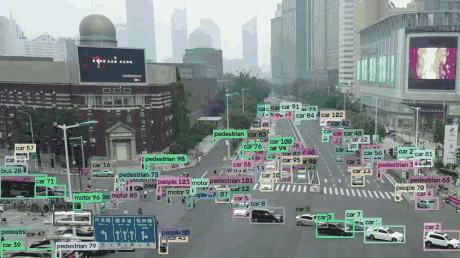

# Small-Object Detection on Drone Imagery

Object detection, tracking and deployment benchmarking with YOLO11 on
VisDrone2019 — trained, evaluated, exported to ONNX, and run through a
tracking pipeline with a measured deployment profile.

Aerial frames are large and the things worth detecting in them are tiny. The
label statistics are measured before training to justify the input resolution
chosen, rather than assumed.

---

## Why this dataset

[VisDrone2019](https://github.com/VisDrone/VisDrone-Dataset) is drone-captured
imagery across 10 classes (pedestrian, car, van, truck, bus, motor, …).

- **6,471** training / **548** validation frames, source images ~2000×1500.
- **38,759** annotated boxes in the validation split alone — a mean of **~71
  objects per frame**, against roughly 7 for COCO.

That object density is not incidental — it drives most of the engineering
decisions below.

---

## The problem, quantified

Before choosing an input resolution, measure what the labels actually look
like. Box areas are normalised in YOLO format, so `w*h` is directly the
fraction of frame covered — no need to open the images.

| ground-truth box scale (val, 38,759 boxes) | share |
| --- | --- |
| small — <0.25 % of frame | **85.9 %** |
| medium — 0.25–1 % | 11.8 % |
| large — >1 % | 2.3 % |

The median box covers 0.055 % of the frame — a **15 px** object at the YOLO
default of 640 px input, or **24 px** at 1024 px. Six out of seven objects in
this dataset are in the regime where downscaling destroys them, which is why
this trains at 1024px rather than the default.

---

## Results

YOLO11n, 1024px, 50 epochs, 197.6 min on an RTX 2070 Max-Q.

**mAP50 0.373, mAP50-95 0.221.** This is the training run's own final
validation (`runs/n_1024/results.csv`, the pass used to select the checkpoint).
`src/benchmark.py` re-validates independently to pair accuracy with its own
latency numbers below and gets a very slightly different figure — mAP50
0.3748, mAP50-95 0.2216, in `reports/benchmark.json`. The in-training pass
runs under AMP (`amp: true` in `runs/n_1024/args.yaml`, so fp16) and the
standalone one in fp32, so the two are not numerically identical. Same
weights, same split.

Per-class breakdown, sorted by difficulty, shows why the aggregate number is
not the interesting one:

| class | P | R | mAP50 | mAP50-95 | share of labels |
| --- | --- | --- | --- | --- | --- |
| bicycle | 0.298 | 0.152 | 0.111 | **0.049** | 3.3 % |
| awning-tricycle | 0.267 | 0.177 | 0.125 | 0.081 | 1.4 % |
| people | 0.524 | 0.300 | 0.304 | 0.113 | 13.2 % |
| tricycle | 0.407 | 0.296 | 0.254 | 0.142 | 2.7 % |
| motor | 0.507 | 0.434 | 0.423 | 0.182 | 12.6 % |
| pedestrian | 0.532 | 0.445 | 0.440 | 0.198 | 22.8 % |
| truck | 0.479 | 0.373 | 0.357 | 0.239 | 1.9 % |
| van | 0.516 | 0.428 | 0.423 | 0.290 | 5.1 % |
| bus | 0.725 | 0.466 | 0.515 | 0.374 | 0.6 % |
| car | 0.697 | 0.797 | 0.796 | **0.548** | 36.3 % |

**The spread between best and worst class (11×) is not explained by label
frequency.** `bus` is the rarest label in the set — 0.6 % of boxes — yet
outperforms `pedestrian`, which has 38× more training signal (22.8 %). What
separates them is apparent size: a bus occupies tens of pixels from altitude,
a pedestrian occupies a handful, and the label-scale table above is exactly
where that prediction came from.

---

## Deployment: export and latency

A detector benchmarked on mAP alone says nothing about whether it fits a
latency budget, so the trained model is exported to ONNX and timed against the
raw PyTorch model across backends.

| backend | median latency | FPS |
| --- | --- | --- |
| PyTorch (CUDA, eager) | 12.49 ms | 80.1 |
| ONNX Runtime (CUDA) | **11.39 ms** | 87.8 |
| ONNX Runtime (CPU) | 101.13 ms | 9.9 |

Median of 100 timed iterations after 20 warmup iterations, with
`torch.cuda.synchronize()` before each stop — GPU work is asynchronous, so
timing without it measures kernel *launch*, not the kernel. ONNX export gives
a modest ~10 % speedup over eager PyTorch on GPU here; the more decisive
number is CPU, roughly **9× slower** than either GPU path — the case for
keeping inference on a GPU-equipped edge device rather than falling back to
CPU.

The GPU path used above is a genuine CUDA execution — worth stating because
ONNX Runtime can silently substitute CPU for a missing CUDA library and still
report success (see the engineering notes below).

---

## Deployment: tracking

`src/track.py` runs the trained detector through ByteTrack on a video source
and reports a staged latency profile — decode, detect+track, annotate, encode
— reconciled against wall-clock time, so no part of the frame budget goes
unmeasured.

**Footage.** VisDrone2019-DET is sampled from video at a 200-frame interval —
readable straight off the filenames, whose frame-index field steps
`1, 201, 401, 601 …` — so it cannot support a tracking demo on its own.
`src/make_demo_clip.py` instead pans a crop window across one real, densely
labelled frame, producing synthetic camera motion over real imagery. That
exercises the full decode → detect → track → encode pipeline and ByteTrack's
association logic under realistic latency; it does not exercise independently
moving objects or occlusion, so track-continuity numbers below describe the
*pipeline*, not tracking accuracy against ground truth.



90 frames, 1024px:

| stage | median | mean |
| --- | --- | --- |
| decode | 1.01 ms | 1.56 ms |
| detect + track | 31.70 ms | **98.00 ms** |
| annotate | 3.08 ms | 3.51 ms |
| encode | 2.34 ms | 2.45 ms |
| **accounted** | | **105.52 ms** |
| **wall per frame** | | **105.58 ms** |

Coverage 99.9 % — the profile accounts for nearly all of wall-clock time.
Median and mean disagree sharply on one stage because of one frame: the first
frame costs **5,971 ms — 188× the steady-state 31.7 ms**, from CUDA context
creation and cuDNN autotuning. Amortised over 90 frames that is most of the
gap between the mean (98.00 ms) and the median (31.70 ms), which is why this
clip's end-to-end throughput (**9.5 FPS**) is well below its steady-state rate.
Steady state has to sum every stage's median, not just the largest one — decode,
annotate and encode still happen every frame once the cold start is behind you
— which gives **38.13 ms/frame → 26.2 FPS**, not the ~31 FPS a detect+track-only
figure would suggest. That distinction matters for short-clip batch processing
versus a long-running stream.

Association quality: 306 unique tracks, mean length 10.3 frames, 26.1 %
single-frame ("fragmented") tracks. ByteTrack's internal id counter reached
9,525 while only 306 ids were ever confirmed — it increments for every
*tentative* track, including ones spawned by detections that never get
confirmed, so anything keying on track id downstream (a counter, a database)
inherits the larger number.

---

## Engineering notes

Findings from profiling and cross-checking real runs.

### AutoBatch under-sized the batch by 4×

Ultralytics' `batch=-1` profiles a forward/backward pass and picks a batch
size targeting ~60% of VRAM. On VisDrone it selected **batch=4**, and the GPU
sat at 37% utilisation drawing 42 W with 2.4 of 8 GB in use. The profiler
over-weights peak memory during label assignment, which scales with box count
— and at ~85 boxes/image VisDrone is close to a worst case for that heuristic.
Fixing the batch to a size chosen from steady-state usage (1.16 GB) rather
than the profiler's estimate took utilisation to 85%.

### JPEG decode was the real bottleneck

Even at the correct batch size, decoding 2000×1500 JPEGs every epoch — 6,471
of them — kept the dataloader, not the GPU, as the limiting factor.
`cache='disk'` pre-decodes each image to `.npy` once and reads that back on
subsequent epochs, taking epochs from ~5 minutes to ~60 seconds.

### CUDA version pinning

The driver on this machine (532.09) supports CUDA up to 12.1, but PyTorch's
default PyPI wheels are CPU-only and its current CUDA wheels target 12.8,
which needs a 570+ driver. The cu124 build works via CUDA 12.x minor-version
compatibility:

```bash
pip install torch torchvision --index-url https://download.pytorch.org/whl/cu124
```

Verified with a real device-side matmul rather than trusting
`torch.cuda.is_available()`, which returns `True` for builds that later fail
at kernel launch.

### ONNX Runtime silently fell back to CPU under a GPU label

The first latency measurement produced an "ORT-GPU" number nearly identical to
the CPU number. Buried in the log:

```
Error loading onnxruntime_providers_cuda.dll
which depends on "cublasLt64_13.dll" which is missing
```

`onnxruntime-gpu` 1.28 is built against CUDA 13; this machine runs CUDA 12.4.
ORT logged the load failure, **silently fell back to the CPU provider, and
returned success.** Passing `providers=['CUDAExecutionProvider']` is a
request, not a guarantee. Fix: pin `onnxruntime-gpu==1.20.2` (the CUDA 12
line), and make the benchmark verify `sess.get_providers()` against what was
requested rather than trusting it — a benchmark that silently mislabels its
backend is worse than one that crashes.

### Augmentation choices

Defaults are tuned for COCO — ground-level, object-centric photography. Two
deviations for nadir aerial imagery: `flipud=0.5`, because an overhead scene
has no canonical "up" so vertical flips are label-preserving here; wider scale
jitter (`scale=0.5`), because apparent object size is the primary axis of
variation in this dataset. Mosaic is disabled for the final 10 epochs
(`close_mosaic=10`) since it distorts the scale statistics the model needs to
converge on.

---

## What this does not establish

**Only one input resolution was trained.** 1024px was chosen from the label
statistics, not compared against alternatives on this model — a resolution
sweep would make that a measured trade-off rather than a single data point.

**Tracking numbers are pipeline throughput, not tracking accuracy.** The
demo clip has no independently moving objects or occlusion, and no ground
truth track ids exist to score association against.

**Latency figures come from a power-limited laptop GPU** (RTX 2070 Max-Q).
The relative ordering of backends transfers; the absolute milliseconds do not.

---

## Setup

```bash
conda create -n yolo -c conda-forge --override-channels python=3.11 pip -y
conda activate yolo

pip install torch torchvision --index-url https://download.pytorch.org/whl/cu124
pip install ultralytics onnx onnxslim opencv-python
pip install "onnxruntime-gpu==1.20.2"   # CUDA 12 line -- see engineering notes
```

Both pins are load-bearing: `--index-url .../cu124` avoids the CPU-only wheels
PyPI serves by default, and `onnxruntime-gpu==1.20.2` avoids a build that
expects CUDA 13 and silently degrades to CPU.

Point Ultralytics at a drive with room — VisDrone plus its disk cache needs
~35 GB — and make sure every configured directory actually exists first;
Ultralytics silently resets all settings to defaults if one is missing:

```python
from pathlib import Path
from ultralytics import settings

for d in ("datasets", "runs", "weights"):
    Path(f"<path>/{d}").mkdir(parents=True, exist_ok=True)

settings.update({
    "datasets_dir": "<path>/datasets",
    "runs_dir": "<path>/runs",
    "weights_dir": "<path>/weights",
})
```

The dataset downloads automatically on first run.

Alternatively, build the provided image (CUDA 12.4, matching the pins above):

```bash
docker build -t aerial-detection .
docker run --gpus all -it -v ${PWD}/datasets:/workspace/datasets aerial-detection bash
```

## Usage

```bash
# Train (1024px, chosen from the label-size distribution above).
# --batch 6, not the default 16: at 1024px, activation memory per image is
# high enough that batch 16 does not fit in 8 GB VRAM.
python src/train.py --model yolo11n.pt --imgsz 1024 --epochs 50 --batch 6 --name n_1024

# Per-class metrics + ground-truth object-size distribution
python src/evaluate.py --weights runs/n_1024/weights/best.pt --imgsz 1024

# ONNX export + latency across backends (run on an idle GPU)
python src/benchmark.py --weights runs/n_1024/weights/best.pt --imgsz 1024

# Video inference + ByteTrack, with a staged latency profile
python src/make_demo_clip.py --frames 90
python src/track.py --weights runs/n_1024/weights/best.pt --source reports/demo_pan.mp4
```

## Layout

```
src/train.py            training at a chosen input resolution
src/evaluate.py         per-class metrics; label-size distribution
src/benchmark.py        ONNX export; latency on PyTorch / ONNX Runtime GPU / CPU
src/track.py            video inference + ByteTrack; staged latency profile
src/make_demo_clip.py   synthetic-motion clip for the tracking demo
runs/                   training artefacts (weights gitignored)
reports/                benchmark and tracking output
```
